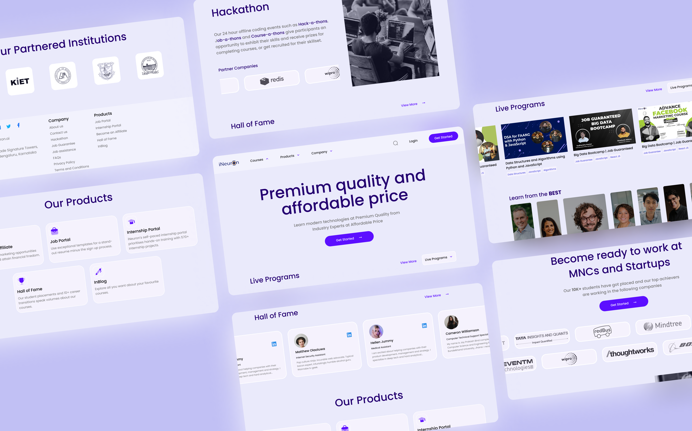

# ineuron-landing-page

This is my submission for [Hackathon for Javascript]("https://www.findcoder.io/challenges/Hackathon%20for%20Javascript%20live%20batch/62e3ddecf1306512201c9de0") where I redesigned UI/UX of iNeuron landing page and made it responsive. The landing page is live [here]("https://ineuron-landing-page-nine.vercel.app/").



## Features

- 🖥 Responsive
- 🤩 Animations and Micro Interactions
- 🎹 Clean UI
- 🦄 Custom Cursor
- 🪗 Tailwind CSS Design System

## Get Started

**Get the project ready and run it**

```bash
git clone https://github.com/AkashSDas/ineuron-landing-page.git
cd ineuron-landing-page
yarn install
yarn run dev
```

## License

[MIT](LICENSE)
